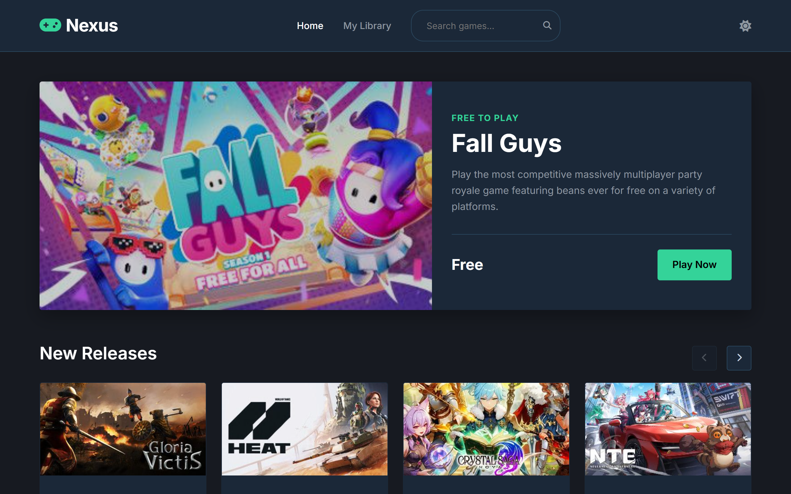
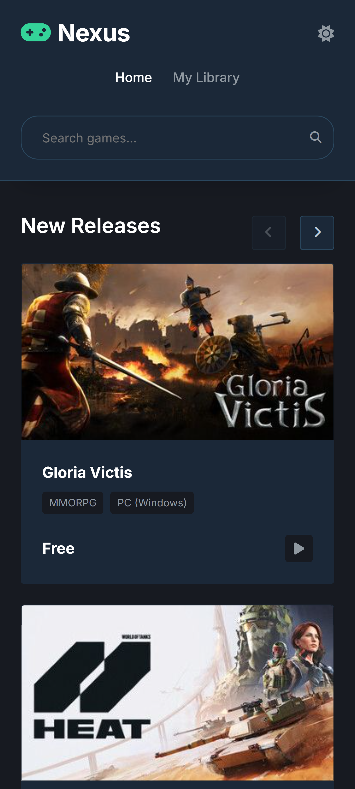
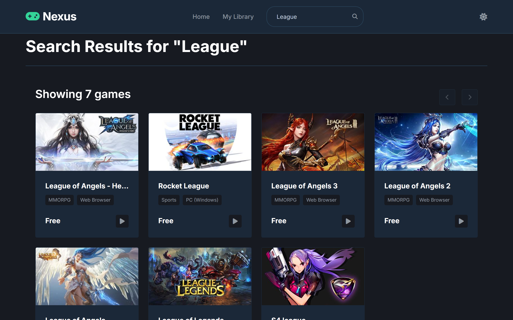
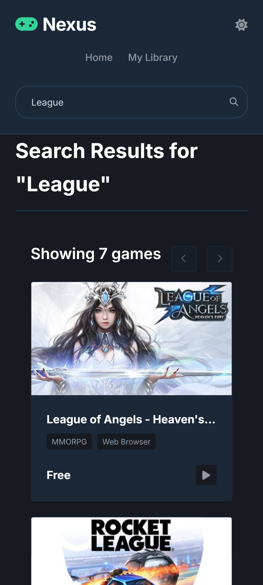
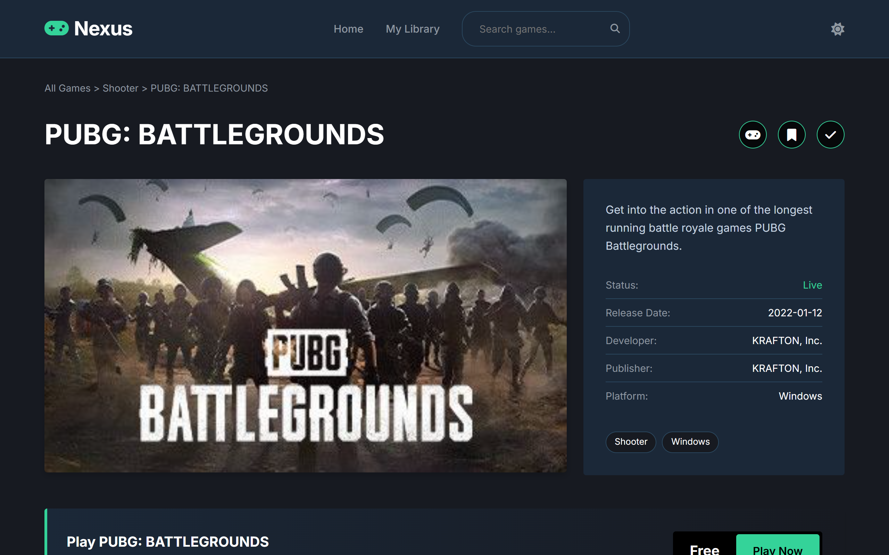
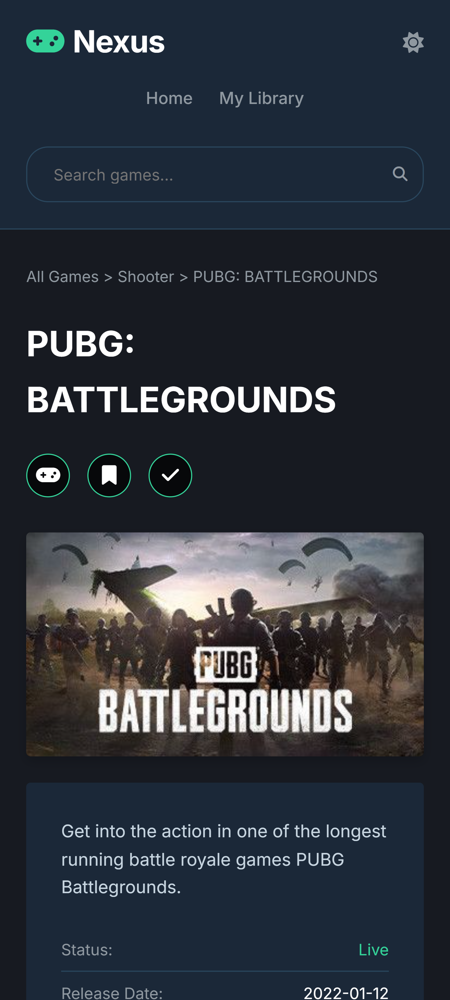
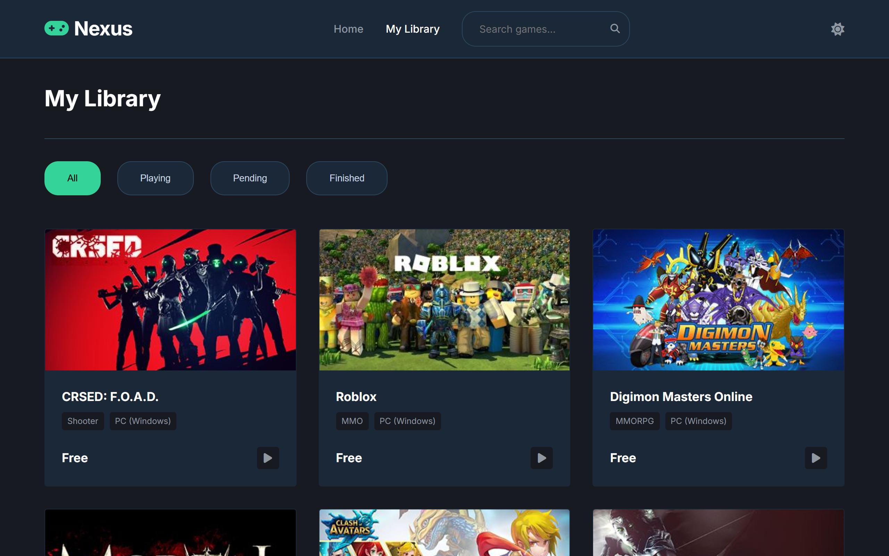
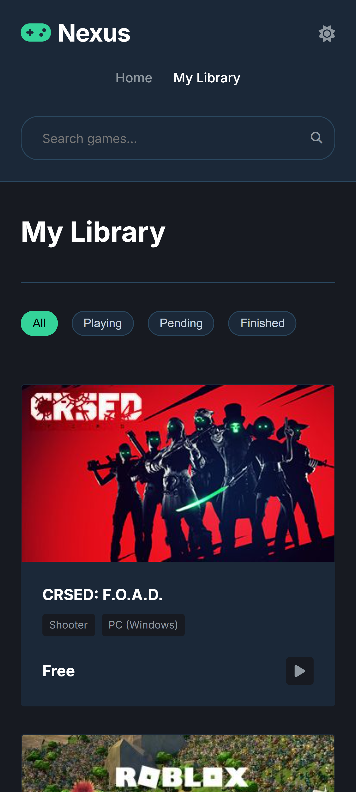

# Nexus

**Desarrollado por:** [Randolh](https://github.com/Randolh)

## Descripción del Proyecto
Nexus es una moderna aplicación web diseñada para explorar, buscar y gestionar videojuegos "Free-To-Play" (gratuitos). Su interfaz cuenta con un diseño dinámico (incluyendo Modo Claro/Oscuro, buscador en tiempo real, transiciones de página suaves y un gestor de biblioteca local) todo construido utilizando JavaScript, HTML y CSS. 

Esta aplicación obtiene los datos y detalles de los videojuegos consumiendo la **FreeToGame API**.

## API Utilizada
- **API:** FreeToGame
- **Documentación Oficial:** [https://www.freetogame.com/api-doc](https://www.freetogame.com/api-doc)

## Capturas de Pantalla

A continuación, algunas capturas de la aplicación en funcionamiento tanto en versión de escritorio como en versión móvil:

### Vista Principal (Home)
<p align="center">
  
  
</p>

### Búsqueda en Tiempo Real
<p align="center">
  
  
</p>

### Detalles del Juego
<p align="center">
  
  
</p>

### Mi Biblioteca
<p align="center">
  
  
</p>

## Cómo ejecutar el proyecto localmente

Este proyecto utiliza tecnologías web nativas (HTML, CSS y JS), por lo que no requiere de la instalación de dependencias para funcionar.

Debido al uso de módulos (`type="module"`) en JavaScript, es necesario ejecutar la aplicación mediante un servidor local.

### Opción 1: Usando Python (Terminal)
Si tienes Python instalado, abre tu terminal en la carpeta del proyecto y ejecuta el siguiente comando:
```bash
python3 -m http.server 8000
```
Luego, abre tu navegador y visita `http://localhost:8000`.

### Opción 2: Usando Live Server (VS Code)
1. Abre la carpeta del proyecto en Visual Studio Code.
2. Asegúrate de tener instalada la extensión **Live Server**.
3. Haz clic derecho sobre el archivo `index.html` y selecciona **"Open with Live Server"**.
